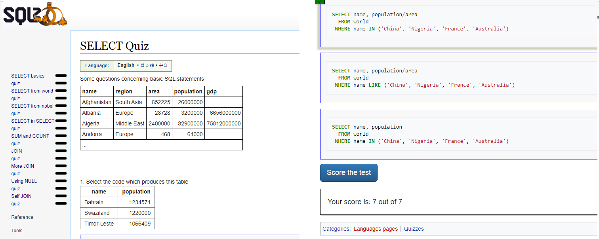

# SELECT Quiz
 This file contains answers to the quizes on https://sqlzoo.net, the activity was accomplished to satisfy Microverse Technical Curriculum - Database Section

## Screenshot

## :hammer: Built With
* SQL
* Atom

## Use online
The quiz can be found online 
Link: [Live Demo Link](https://sqlzoo.net/wiki/SELECT_Quiz)
##  :bust_in_silhouette: Worked on this challenge:
# Rayan Rassam
* Github:[@Rayan84](https://github.com/Rayan84)
* Twitter:[@Rayan65096267](https://twitter.com/Rayan65096267)
* LinkedIn:[@rayan rassam](https://www.linkedin.com/in/rayan-rassam-18a0a426/)

## Contribution
Contributions, feedback and feature requests are welcome!
Feel free to check the [Issue](https://github.com/Rayan84/SQL-Zoo/issues) and help me improve!
